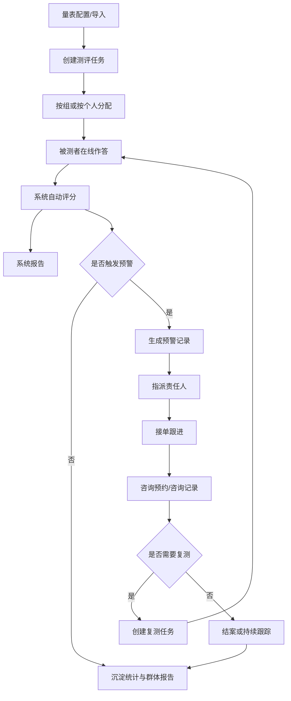

# 业务流程设计

## 1. 主流程总览

系统业务主链路如下：

1. 量表配置或导入
2. 创建测评任务
3. 按组或按个人分配测评
4. 被测者在线答题
5. 系统即时评分与生成报告
6. 识别风险并生成预警
7. 责任人接单与跟进
8. 咨询预约与咨询记录
9. 干预状态流转
10. 复测或结案
11. 群体报告与统计沉淀

## 2. 量表管理流程

1. 管理员创建量表或导入量表模板
2. 配置量表基本信息、维度、题目、选项和计分规则
3. 校验量表数据合法性
4. 量表保存为草稿或发布状态
5. 发布后用于后续测评任务

### 2.1 导入异常流程

1. 系统校验导入文件格式和字段完整性
2. 导入失败时返回错误明细
3. 管理员修正模板后重新导入
4. 成功前不进入正式量表库

## 3. 测评任务流程

1. 管理员选择量表
2. 设置任务名称、时间范围、实名/匿名规则
3. 选择按组分配或按个人分配
4. 系统生成任务及分配记录
5. 被测者收到任务提醒
6. 管理员跟踪完成率与未完成情况

## 4. 在线测评流程

1. 被测者登录系统
2. 查看本人待办任务
3. 进入答题页面
4. 开始答题并记录开始时间
5. 中途保存或直接提交
6. 提交后记录提交时间和作答时长
7. 系统锁定答卷

## 5. 报告生成流程

1. 用户提交答卷
2. 系统根据量表规则自动评分
3. 计算总分、维度分和风险等级
4. 生成系统自动报告
5. 将结果返回给被测者或授权查看者

## 6. 预警流程

1. 系统根据预警规则识别高风险或关注对象
2. 生成预警记录
3. 指派责任人或责任角色
4. 责任人接单
5. 进入处理状态
6. 填写跟进记录
7. 转入复测、预约、转介或结案

## 7. 预警升级流程

系统需要支持预警超时控制，建议流程如下：

1. 生成预警时写入应处理时限
2. 到期前发送提醒
3. 超时未接单时升级通知
4. 超时未处理时继续升级
5. 对高风险对象采用更高优先级

### 7.1 优先级与阈值建议

- 高风险：最短响应时限，优先升级
- 关注级：正常处理时限
- 一般级：可仅记录或纳入观察

超时阈值建议支持按量表、风险等级或组织场景配置。

### 7.2 转介与外部通知链路

当咨询师判断需要外部专业支持时，流程可扩展为：

1. 创建转介记录
2. 更新干预状态为已转介
3. 记录转介机构或转介说明
4. 保留后续回访或复测入口

## 8. 咨询预约流程

1. 咨询师配置可预约时间
2. 被测者或管理员发起预约
3. 选择咨询师和可预约时段
4. 生成预约记录
5. 咨询师确认并查看排班
6. 咨询完成后填写咨询记录
7. 更新干预状态

## 9. 通知与提醒流程

1. 系统生成测评任务后发送任务提醒
2. 截止前发送未完成提醒
3. 预警生成后向责任人发送预警提醒
4. 预约成功后向咨询师和被测者发送预约提醒
5. 创建复测任务后发送复测提醒

## 10. 干预闭环流程

1. 系统预警
2. 指派责任人
3. 咨询师查看个体报告
4. 记录人工研判
5. 安排咨询或干预
6. 填写咨询记录
7. 视情况安排复测
8. 更新状态为继续跟进或结案

## 11. 匿名与实名规则

### 11.1 实名测评

- 支持个体报告
- 支持个体预警
- 支持预约与干预
- 支持复测跟踪

### 11.2 匿名测评

- 主要用于群体统计和群体画像
- 默认不进入个体预警和个体干预流程

### 11.3 受限匿名扩展建议

如后续存在“脱敏后仍需内部追踪”的场景，可设计脱敏/脱标机制，例如：

- 结果侧仅展示脱敏标识
- 身份映射单独存放并受更高权限控制
- 默认仅授权极少数角色访问映射关系

## 12. 结案规则建议

结案前建议满足以下条件之一：

- 已完成咨询并形成结论
- 已记录必要干预措施
- 已安排并完成复测
- 已转介至外部机构

结案时需记录：

- 结案人
- 结案时间
- 结案说明
