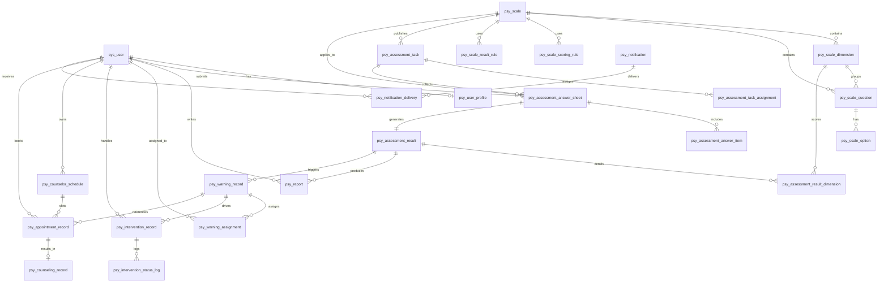
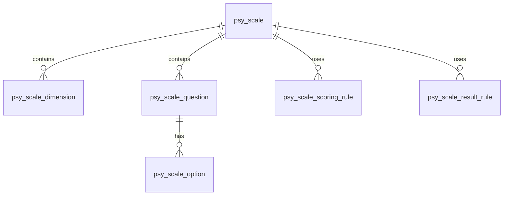
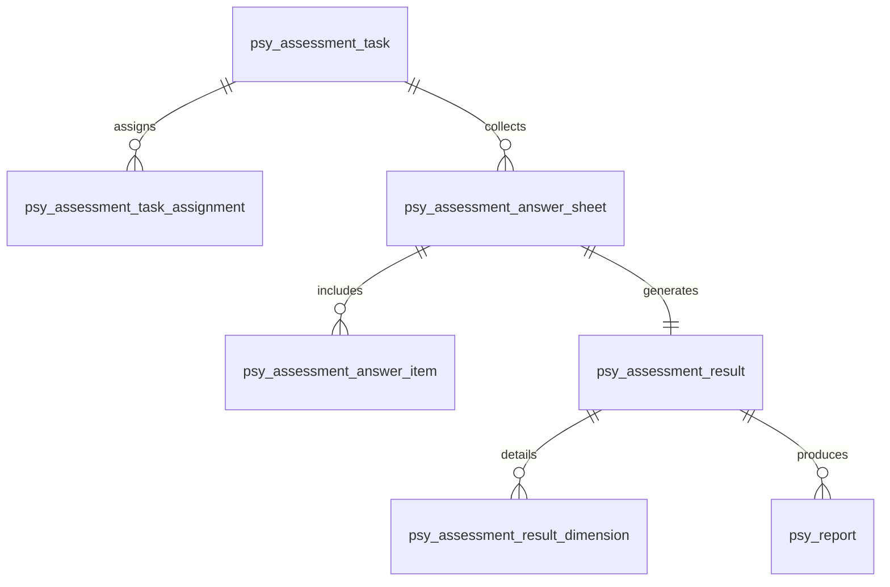
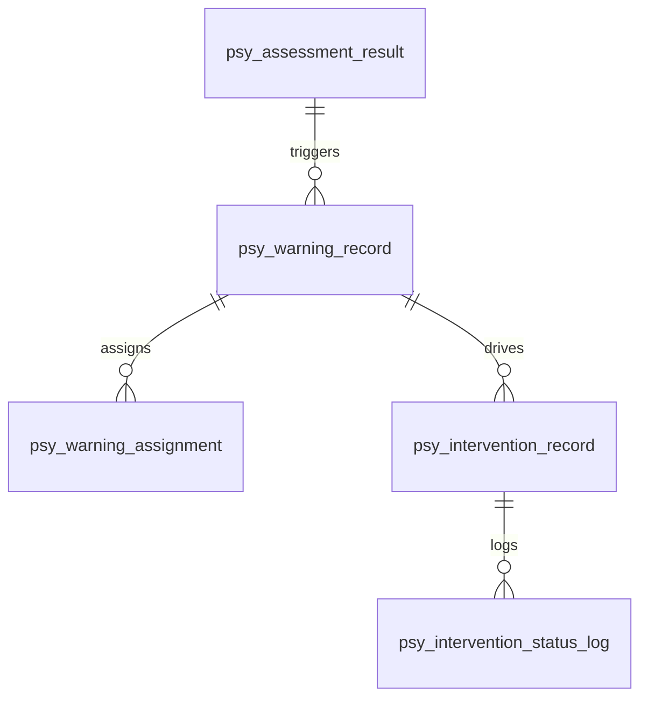
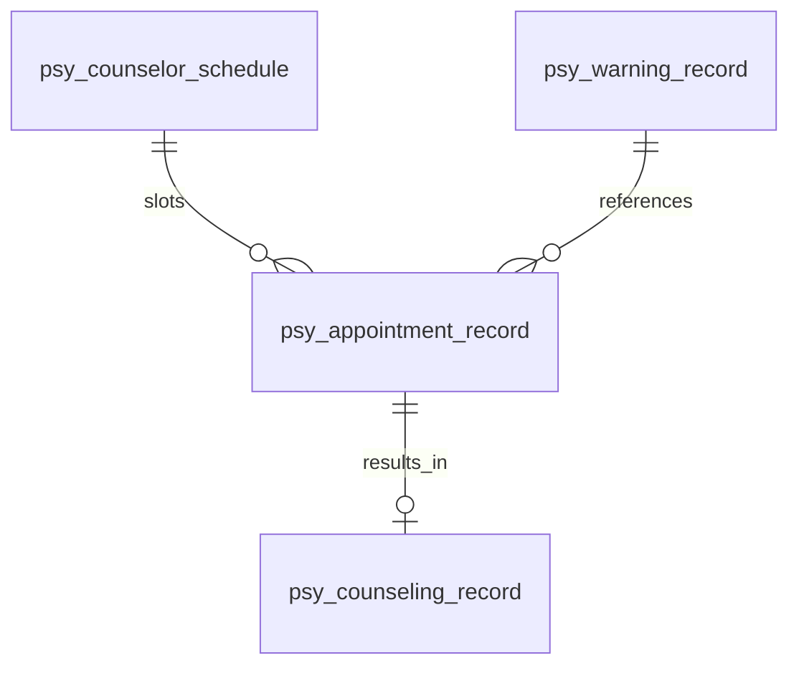
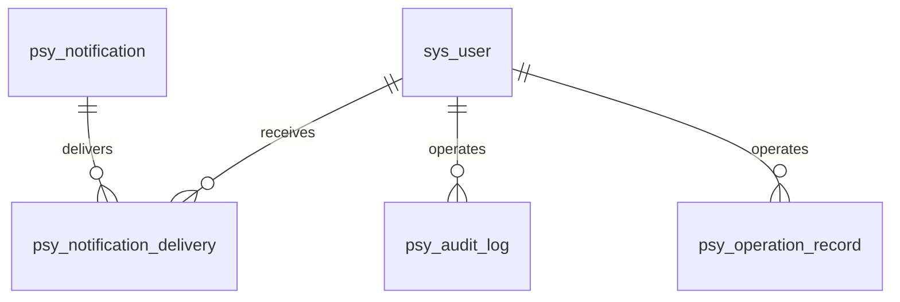

# ER 图设计

## 1. 文档目的

本文档用于以关系图方式展示心理测评系统核心实体之间的关联关系，辅助数据库设计评审、后端建模和接口联调。

## 2. 核心关系图

## 3. 模块拆分视图

### 3.1 量表模块

### 3.2 测评执行模块

### 3.3 预警与干预模块

### 3.4 预约与咨询模块

### 3.5 通知与审计模块

## 4. 关系说明

- `sys_user` 是账号主实体，所有业务角色都通过它关联。
- `psy_scale` 是量表主实体，向下关联维度、题目、选项、计分规则、结果规则。
- `psy_assessment_task` 负责组织测评分发，`psy_assessment_answer_sheet` 负责承载一次作答。
- `psy_assessment_result` 是一次作答的计算结果中心节点，向下扩展维度结果、报告和预警。
- `psy_warning_record` 是预警链路中心节点，向下连接责任分配、干预记录和预约记录。
- `psy_appointment_record` 与 `psy_counselor_schedule`、`psy_counseling_record` 共同形成预约咨询闭环。

## 5. 后续建议

后续可继续补充：

- 实体字段级 ER 图
- 逻辑删除字段与审计字段统一规范
- draw.io / PlantUML 版本图
> 历史草稿：本文保留用于追溯早期 ERD 设计，不再作为当前数据库结构依据。当前结构以 `backend/src/main/resources/schema-psy.sql` 与 `auth-starter/doc/schema-postgresql.sql` 为准。
